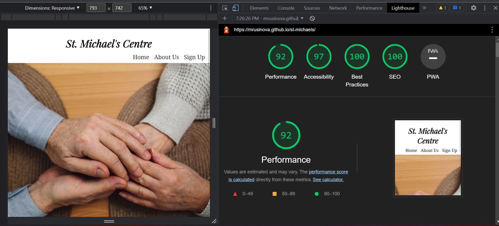

# St. Michael's Centre

St. Michael's Centre is a website that would help the elderly to connect, find suitable activities and be more active in the later years of their life. They will be able to sign up and choose to be contacted for one or all three activities.

## Features

### Navigation Bar
<li>Featured on all three pages of the website it allows users to navigate the pages of the website
<li>It can be used across all devices without having to go back using the back button

### Activities section
<li>This section shows the user the activities the centre offers including short information about them and their benefits plus images to show what the activity is

### Footer
<li>Featured on all three pages includes 4 social media links for Facebook, Twitter, Instagram and Youtube with appropriate icons
<li>Encourages the user to connect to the centre thru its social media
    Brief hystory and goals of the centre
<li>Includes Address, Phone number, email and a map

### Sign Up
<li>This page is to allow the user to sign up and chose which activities to be contacted about
<li> The user can choose one, two or all three activities

### Testing
<li>I have tested my website in different browsers - Chrome, Microsoft Edge and Mozilla Firefox
<li>I confirmed that navigation, social media links and form work.

### Validator Testing
<li>HTML

I have left this error as my mentor said I should leave the action empty as I dont actually want the user to register and one of the requirements is for the user not to have to use the back button to get back to my website

<li>Lighthouse Desktop

<li>Lighthouse Mobile

<li>CSS

<li>Bugs
<li>after deploying my project I discovored my images were not showing because I used absolute file paths, fixed that by removing the "../" of my file paths
<li>When testing my project on w3 HTML validatior I discovered 9 Errors with the map on my about page. I followed the istructions of the errors and fixed the code.

### Credits
### Media
<li>All images have been taken from (https://www.pexels.com/)
<li>Used [Canva](https://www.canva.com/) to resize my images

### Content
<li>The code for the social media links was taken from Love Running project
<li>The information on how to use flexbox was taken from W3Schools
<li>Used code from Azharul Rafy on youtube to get rid of white space on the side of my images for activities for media queries
<li>Copied and pasted information about Yoga from (https://nytimes.com)
<li>Copied some information about St. Michael's Centre from their original website
<li>For my form I used code from my form challenge from Love Running
<li>Centered my form with display: flex; source - (https://blog.hubspot.com)
<li>The icons for the activities were taken from Font Awesome
<li>The fonts used were taken from Google fonts

### Deployment
<li>The site was deployed to GitHub pages. The steps to deploy are as follows:
<li>In the GitHub repository, navigate to the Settings tab
<li>From the source section drop-down menu, select the Master Branch
<li>Once the master branch has been selected, the page will be automatically refreshed with a detailed ribbon display to indicate the successful deployment.

The live website can be seen here : https://mrusinova.github.io/st-michaels/