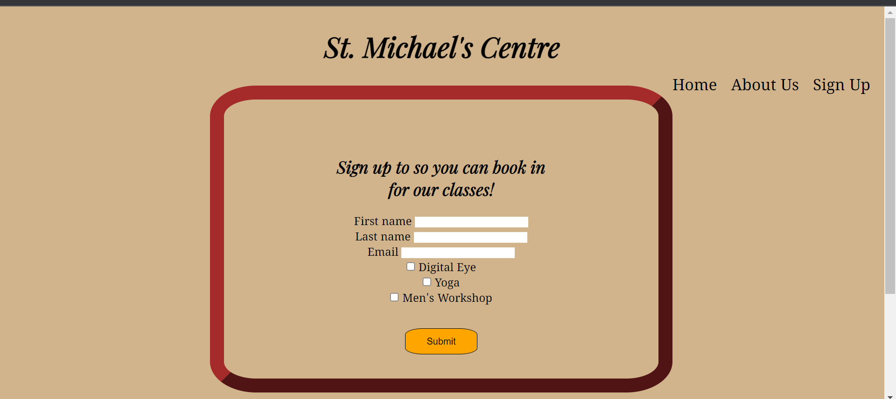

# St. Michael's Centre

St. Michael's Centre is a website that would help the elderly to connect, find suitable activities and be more active in the later years of their life. They will be able to sign up and choose to be contacted for one or all three activities.

## Features

### Navigation Bar
<li>Featured on all three pages of the website it allows users to navigate the pages of the website
<li>It can be used across all devices without having to go back using the back button

### Activities section
<li>This section shows the user the activities the centre offers including short information about them and their benefits plus images to show what the activity is

### Footer
<li>Featured on all three pages includes 4 social media links for Facebook, Twitter, Instagram and Youtube with appropriate icons
<li>Encourages the user to connect to the centre thru its social media
    Brief hystory and goals of the centre
<li>Includes Address, Phone number, email and a map

### Sign Up
<li>This page is to allow the user to sign up and chose which activities to be contacted about
<li> The user can choose one, two or all three activities
